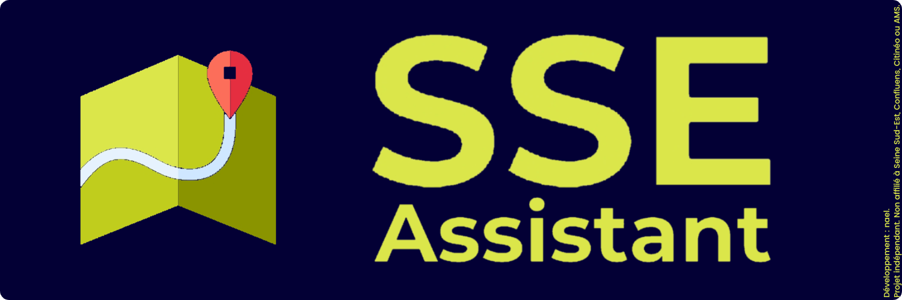

  

**Disponible sur les plateformes suivantes :** 

# 🚌 SSE Assistant

**SSE Assistant** est un outil conçu pour accompagner les conducteurs et joueuses/joueurs du réseau **Seine Sud-Est (SSE)** dans leurs trajets.

Ce logiciel affiche les arrêts, destinations, commandes clavier et plus encore dans une interface claire, efficace et personnalisée selon la ligne.

> ⚠️ **Ce projet est entièrement indépendant.**  
> Il **n’est affilié à aucune entité officielle** liée à **Seine Sud-Est, Confluens, Citinéo ou AMS**.

---

## 🧠 Sommaire

- [✨ Fonctionnalités](#-fonctionnalités)
- [⚙️ Installation](#-installation)
- [▶️ Utilisation](#️-utilisation)
- [🖼️ Captures d’écran](#️-captures-décran)
- [🤝 Contribuer](#-contribuer)
- [📩 Contact](#-contact)
- [📄 Licence](#-licence)
- [🚀 Version PRO](#-version-pro)
- [#️⃣ Languages utilisés](#-languages-utilisés)

---

## ✨ Fonctionnalités

- Interface Tkinter simple et fluide
- 📍 Affichage des arrêts d’une ligne en **temps réel**
- 🖼️ Logos + couleurs personnalisées pour chaque ligne
- ⌨️ Commandes clavier configurées par ligne
- 🚦 Lecture **automatique ou manuelle** des arrêts
- 🛰️ Intégration **SAE**
- 🪄 Mode simplifié pour petits écrans
- 🎯 Affichage des destinations
- ⚡ Bientôt disponible en `.exe` sans Python !

---

## ⚙️ Installation

La version `.exe` sera disponible dans l’onglet **Releases** dès la v1.0.

---

## ▶️ Utilisation

1. Lance l'appli

2. Choisis la ligne + destination

3. Utilise les commandes pour faire défiler les arrêts

4. Suis ton trajet en mode manuel ou auto !

---

## 🖼️ Captures d’écran

(à venir très bientôt !)

---

## 🤝 Contribuer

Envie d’aider ou de proposer une idée ?
Rends-toi dans l'espace Discussions ou envoie un p’tit message via Discord :
**@flywithnael**

---

## 📩 Contact

Développé par Naël MOGHIR

*Projet personnel libre et non commercial.*

Mail : translinkstudios@proton.me

---

## 📄 Licence

Ce projet est sous licence MIT.
Tu peux l’utiliser, l’améliorer ou le partager librement.
Consulte le fichier LICENSE pour les détails.

---

## 🚀 Version PRO

Vous voulez une version plus avancée, avec plus de fonctionnalités, un design retravaillé et une expérience utilisateur améliorée ?

➡️ [**Cliquez ici pour découvrir la branche PRO**](https://github.com/flywithnael/SSE-Assistant/tree/pro)

---

## #️⃣ Languages utilisés

